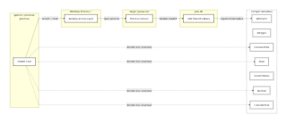
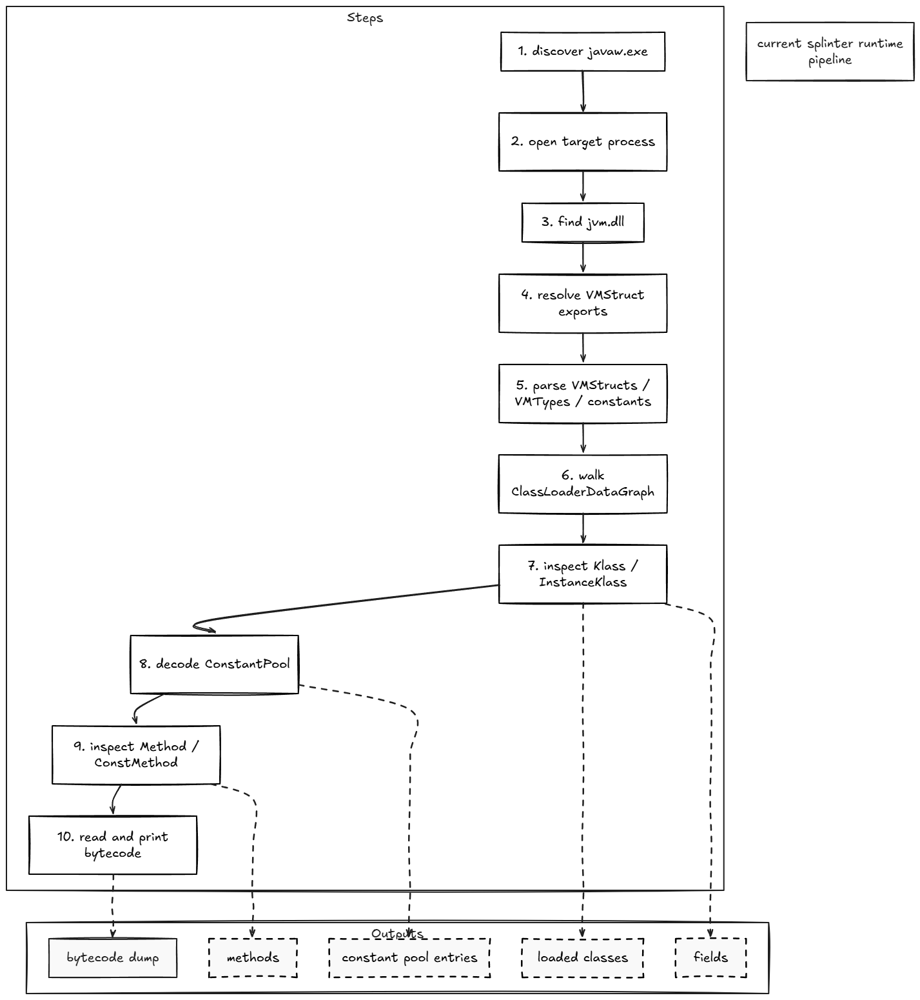
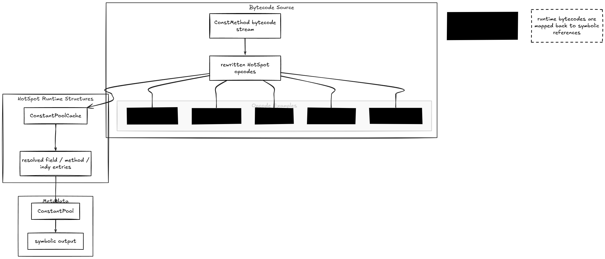

# splinter

splinter is a jvm analysis toolkit, allowing the user to view classes, methods, fields, constant pools and bytecode on runtime

## what is splinter?

usually, when you think of an analysis toolkit for the jvm, you would think it uses jni or jvmti, but not splinter!

splinter is actually external and has these capabilities right now:

- can read hotspot vmstructs from a running process
- can decode bytecode live over `Method` and `ConstMethod`

the long-term goal is for it to be a runtime jvm analysis toolkit for:

- loaded class inspection
- method and field inspection
- constant-pool decoding
- bytecode disassembly
- class graph and metadata analysis

## current state

the current code base is currently a foundation, but it still functions

as of writing this (3/11/2026), splinter can:

- attach to a readable `javaw.exe` process automatically
- locate `jvm.dll` in the target process
- resolve HotSpot exported VMStruct tables from `jvm.dll`
- parse:
  - VMStruct fields
  - VMTypes
  - HotSpot int constants
  - HotSpot long constants
- list loaded klasses through `ClassLoaderDataGraph`
- inspect `Klass` and `InstanceKlass`
- decode constant-pool entries
- decode HotSpot field streams from `InstanceKlass::_fieldinfo_stream`
- inspect `Method` / `ConstMethod`
- read live bytecodes
- disassemble bytecode with HotSpot rewritten/runtime bytecode support

## bytecode

one of the cooler parts of splinter is that it doesnt use classfile-format bytecode, it actually uses runtime bytecode instructions from the hotspots interpreter which is later read back to you as symbolic class/method/field references.

it matters because the hotspot actually tends to rewrite some instructions at runtime. we currently r handling:

- `invokedynamic` encoded indexes
- hotpsot fast bytecodes such as:
  - `fast_iaccess_0`
  - `fast_igetfield`
  - `fast_aldc`
  - `invokehandle`

