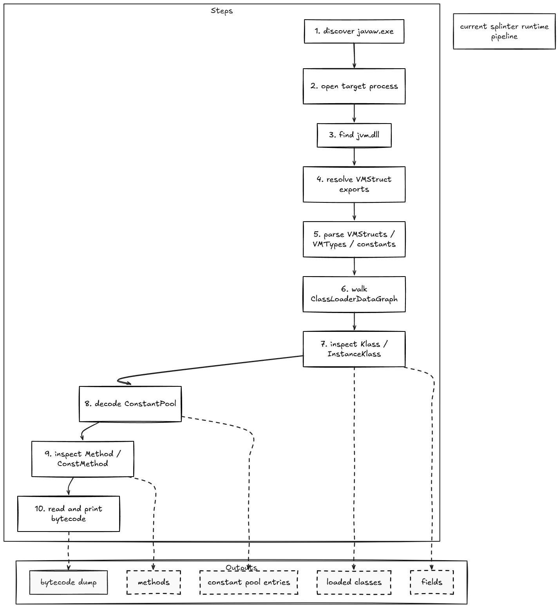
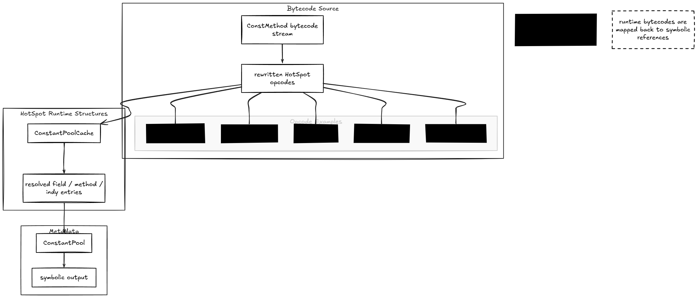

# splinter

splinter is a jvm analysis toolkit, allowing the user to view classes, methods, fields, constant pools and bytecode on runtime. this was originally written against openjdk build 22.0.2+9-70 and also runs against zulu 25.0.1

## what is splinter?

usually, when you think of an analysis toolkit for the jvm, you would think it uses jni or jvmti, but not splinter!

splinter is fully external. it opens the target with `PROCESS_VM_READ` only, never writes to it, and never loads anything into it.

- can read hotspot vmstructs from a running process
- can decode bytecode live over `Method` and `ConstMethod`



## usage

```
splinter [options]

target selection:
  --pid <id>            attach to a specific process id
  --process <name>      image name to look for, repeatable
                        (defaults to javaw.exe then java.exe)
  --list-processes      show every java process and whether it can be read

queries:
  --info                target, vmstruct and index summary (default)
  --list-classes        list loaded classes
  --search <text>       list loaded classes whose name contains text
  --class <name>        inspect one class, use the internal name (java/lang/String)
  --method <name>       with --class, inspect matching methods
  --descriptor <desc>   narrow --method to one descriptor
  --constants           dump the selected class constant pool
  --disasm              disassemble the selected methods
  --limit <n>           cap list output, 0 for no cap (default 50)
```

for example, `splinter --class java/lang/String --method isEmpty --disasm`:

```
  0x1318B748 isEmpty () -> boolean
    code=14 maxStack=1 maxLocals=1 lines=0 locals=0 handlers=0 checked=0 params=0
    10 instructions, operands read as rewritten
        0: nofast_aload_0
        1: nofast_getfield #9 java/lang/String value [B
        4: arraylength
        5: ifne target=12
        8: iconst_1
        9: goto target=13
       12: iconst_0
       13: ireturn
```

## current state

splinter can:

- attach to a java process by pid, by image name, or by picking the first readable one
- locate `jvm.dll` in the target process
- resolve HotSpot exported VMStruct tables from `jvm.dll`
- parse:
  - VMStruct fields
  - VMTypes
  - HotSpot int constants
  - HotSpot long constants
- list loaded klasses through `ClassLoaderDataGraph`
- inspect `Klass` and `InstanceKlass`
- decode constant-pool entries
- decode HotSpot field streams from `InstanceKlass::_fieldinfo_stream`, including injected fields
- inspect `Method` / `ConstMethod`
- read live bytecodes
- disassemble bytecode with HotSpot rewritten/runtime bytecode support

indexing a full desktop app (about 58k classes, 460k methods, 164k fields) takes around 14 seconds.

## bytecode

one of the cooler parts of splinter is that it doesnt use classfile-format bytecode, it actually uses runtime bytecode instructions from the hotspots interpreter which is later read back to you as symbolic class/method/field references.

it matters because the hotspot actually tends to rewrite some instructions at runtime. we currently r handling:

- `invokedynamic` encoded indexes
- hotpsot fast bytecodes such as:
  - `fast_iaccess_0`
  - `fast_igetfield`
  - `fast_aldc`
  - `invokehandle`
- the `nofast_` bytecodes hotspot falls back to

rewriting only happens once a class is linked, so splinter reads `InstanceKlass::_init_state` and decodes operands as plain classfile constant-pool indexes for classes that are loaded but not linked yet.



## reading a running vm

splinter does not suspend the target, so the class graph can change underneath it. it caps and cycle-checks every linked list walk, validates constant-pool indexes against `_length` before reading, and skips only the individual member it could not read instead of dropping the whole class. `--info` reports how much was skipped.

## building

```
cmake -B build
cmake --build build
```

that produces `splinter` and `splinter_tests`. the tests cover the pure decoders (UNSIGNED5, descriptors, instruction lengths) and need no jvm running:

```
ctest --test-dir build
```
